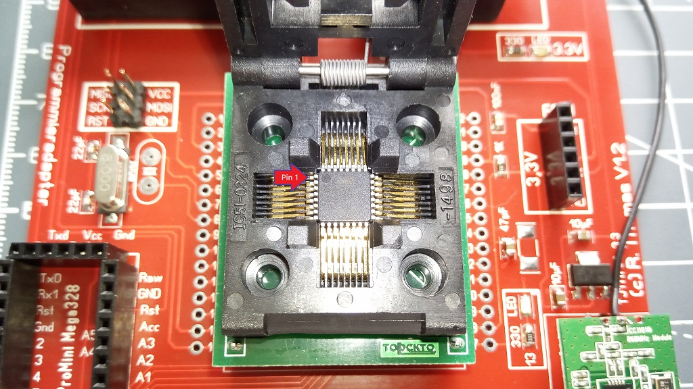

# Programmieradapter für Arduino Pro Mini und ATMEGA328P-AU
## benötigte Hardware
 * 1x TJ1117GS-3.3 oder AMS1117-3.3
 * 2x Kondensator 100nF **0805**
 * 1x Kondensator 100nF **0805** **wer den 328p-au Programmieren will**
 * 3x Widerstand 330Ohm **0805**
 * 1x Widerstand 1KOhm **0805** **wer den 328p-au Programmieren will**
 * 3x Led Rot **0805**
 * 1x Kondensator 47µF **0805** **wer den 328p-au Programmieren will**
 * 2x Kondensator 10µF **0805**
 * 2x Kondensator 22pF **0805** **wer den 328p-au Programmieren will** 
 * 1x Quarz 8,000 MhZ **RM 5,0 oder SMD** **wer den 328p-au Programmieren will** 
 * div. Buchsenleisten / Stiftleisten ja nach bedarf
 * 1x [TQFP32 ZU DIP32 IC Programmer Adapter](https://de.aliexpress.com/item/33016795151.html?spm=a2g0s.9042311.0.0.77e64c4dPMrUan) **wer den 328p-au Programmieren will**  

Mit dieser Adapterplatine könnt ihr ziemlich einfach euere Arduino Pro Mini mit Bootloader / Fuse Bits beschreiben. Als ISP dient ein Arduino Nano mit dem Standart ISP Sketch aus der Arduino Software.
Die ISP Pins sind auch zusätzlich nach aussen gelegt wer einen anderen ISP nutzen will. Der Platz für ein FDTI Adapter ist oben rechts, auch dieser ist mit beiden ICs verbunden. Extra wurden die FDTI pins nach aussen geführt.
Das Funkmodul CC1101 findet unten rechts sein Platz. Das Arduino Pinout unten bezieht sich nur auf den atmega328p-au für development zwecke.
Die ganze Platine arbeitet mit 5V, diese wird über den Spannungsregler auf stablile 3,3V runtergeregelt und versorgt die bzw. den IC. 

**Achtung der 6 polige Eingang für den FDTI ist aussen vor, dort dürfen nur 3,3V rein!**

**Wichtiger Hinweis**
Bei Schreiben von Fuse Bits oder Bootloader darf das Funkmodul nicht gesteckt sein genauso darf der Arduino Nano nicht zusammen mit dem Funkmodul gesteckt sein.            

[Kontakt via Facebook](https://www.facebook.com/ronny.thomas.83)

[Kontakt via Homematic Forum](https://homematic-forum.de/forum/memberlist.php?mode=viewprofile&u=13127)

Leere Platine

Bestückt mit allen SMD Teilen

meine Konfiguration 

